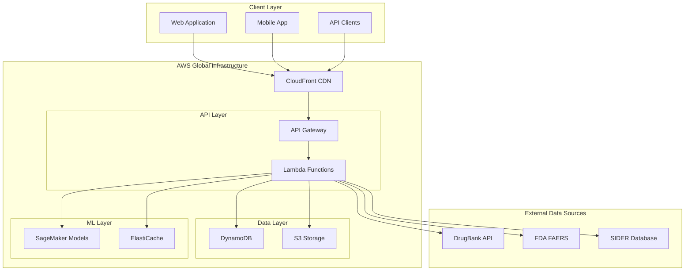

# Drug-Drug Interaction Checker - Design Document

**Project Name:** AI-Powered Drug-Drug Interaction Checker  
**Version:** 1.0  
**Date:** January 2025  
**Created by:** Govind and Ermanno  
**Repository:** https://github.com/elngovind/drug-discovery  

## Overview

The Drug-Drug Interaction Checker is designed as a serverless, globally distributed healthcare platform built on AWS infrastructure. The system processes drug interaction queries in real-time, providing healthcare professionals and patients with immediate safety assessments, side effect information, and alternative medication suggestions.

The architecture prioritizes speed (<3 seconds response time), accuracy (>95% precision), and global accessibility through a content delivery network and offline capabilities.

## Architecture

### High-Level Architecture



### System Components

#### 1. Frontend Layer
- **React.js Web Application**: Responsive design with progressive web app capabilities
- **Mobile-Optimized Interface**: Touch-friendly design for smartphones and tablets
- **Offline Capability**: Service worker for caching critical interaction data

#### 2. API Gateway Layer
- **RESTful Endpoints**: Standardized HTTP APIs with JSON responses
- **Rate Limiting**: 1000 requests per minute per IP address
- **Authentication**: API key management for enterprise integrations
- **CORS Support**: Cross-origin requests for web applications

#### 3. Serverless Compute Layer
- **AWS Lambda Functions**: Auto-scaling compute for interaction processing
- **Node.js Runtime**: Optimized for JSON processing and database queries
- **Cold Start Optimization**: Connection pooling and initialization caching

#### 4. Data Storage Layer
- **DynamoDB Tables**: NoSQL database optimized for fast lookups
- **S3 Buckets**: Static assets, data backups, and ML model storage
- **ElastiCache**: Redis caching for frequently accessed interactions

## Components and Interfaces

### Core Components

#### 1. Drug Interaction Engine
```typescript
interface InteractionEngine {
  checkInteractions(drugs: Drug[]): Promise<InteractionResult[]>
  getSeverityLevel(interaction: Interaction): SeverityLevel
  getAlternatives(drug: Drug, condition: string): Promise<Drug[]>
  getConfidenceScore(interaction: Interaction): number
}
```

**Responsibilities:**
- Process drug combination queries
- Calculate interaction severity levels
- Generate confidence scores based on evidence strength
- Suggest alternative medications

#### 2. Side Effects Service
```typescript
interface SideEffectsService {
  getShortTermEffects(drug: Drug): Promise<SideEffect[]>
  getLongTermEffects(drug: Drug): Promise<SideEffect[]>
  getOverlappingEffects(drugs: Drug[]): Promise<SideEffect[]>
  getMonitoringGuidance(effects: SideEffect[]): Promise<MonitoringAdvice[]>
}
```

**Responsibilities:**
- Retrieve comprehensive side effect information
- Categorize effects by timeline (immediate, short-term, long-term)
- Identify overlapping side effects from multiple drugs
- Provide monitoring and management guidance

#### 3. Drug Database Service
```typescript
interface DrugDatabaseService {
  searchDrug(query: string): Promise<Drug[]>
  getDrugDetails(drugId: string): Promise<DrugDetails>
  normalizeNames(drugName: string): Promise<string[]>
  validateDrugCombination(drugs: Drug[]): Promise<ValidationResult>
}
```

**Responsibilities:**
- Handle drug name resolution and fuzzy matching
- Provide comprehensive drug information
- Support multiple naming conventions (generic, brand, international)
- Validate drug combinations for completeness

#### 4. Evidence Engine
```typescript
interface EvidenceEngine {
  getInteractionEvidence(drugA: Drug, drugB: Drug): Promise<Evidence[]>
  getClinicalStudies(interaction: Interaction): Promise<Study[]>
  getReportedCases(interaction: Interaction): Promise<CaseReport[]>
  calculateEvidenceStrength(evidence: Evidence[]): number
}
```

**Responsibilities:**
- Aggregate evidence from multiple data sources
- Provide clinical study references
- Calculate evidence-based confidence scores
- Support regulatory compliance requirements

### API Interfaces

#### Primary Endpoints

**POST /api/v1/interactions/check**
```json
{
  "drugs": [
    {
      "name": "warfarin",
      "dosage": "5mg",
      "frequency": "daily"
    },
    {
      "name": "aspirin", 
      "dosage": "81mg",
      "frequency": "daily"
    }
  ],
  "patientAge": 65,
  "includeAlternatives": true
}
```

**Response:**
```json
{
  "interactions": [
    {
      "drugA": "warfarin",
      "drugB": "aspirin",
      "severity": "MAJOR",
      "confidence": 0.95,
      "mechanism": "Increased bleeding risk due to anticoagulant synergy",
      "clinicalEffects": ["Increased bleeding time", "Bruising", "GI bleeding risk"],
      "management": "Monitor INR closely, consider dose adjustment",
      "evidence": {
        "sources": ["DrugBank", "FDA FAERS"],
        "studyCount": 23,
        "caseReports": 156
      }
    }
  ],
  "alternatives": [
    {
      "replace": "aspirin",
      "with": "clopidogrel",
      "reason": "Lower bleeding risk with warfarin"
    }
  ],
  "responseTime": "1.2s"
}
```

**GET /api/v1/drugs/{drugId}/effects**
```json
{
  "drug": {
    "name": "metformin",
    "genericName": "metformin hydrochloride"
  },
  "shortTermEffects": [
    {
      "effect": "Nausea",
      "frequency": "Common (>10%)",
      "onset": "Within hours",
      "management": "Take with food"
    }
  ],
  "longTermEffects": [
    {
      "effect": "Vitamin B12 deficiency",
      "frequency": "Uncommon (1-10%)",
      "onset": "Months to years",
      "monitoring": "Annual B12 levels"
    }
  ]
}
```

## Data Models

### Core Data Structures

#### Drug Model
```typescript
interface Drug {
  id: string;                    // Unique identifier
  name: string;                  // Primary name
  genericName: string;           // Generic/chemical name
  brandNames: string[];          // Commercial names
  rxNormCode?: string;           // RxNorm identifier
  atcCode?: string;              // ATC classification
  description: string;           // Drug description
  therapeuticClass: string[];    // Therapeutic categories
  mechanism: string;             // Mechanism of action
  metabolism: string[];          // Metabolic pathways
  contraindications: string[];   // Absolute contraindications
  warnings: string[];            // Important warnings
}
```

#### Interaction Model
```typescript
interface Interaction {
  id: string;
  drugA: Drug;
  drugB: Drug;
  severity: 'CRITICAL' | 'MAJOR' | 'MODERATE' | 'MINOR';
  confidence: number;            // 0-1 confidence score
  mechanism: string;             // Biological mechanism
  clinicalEffects: string[];     // Observable effects
  onset: string;                 // Time to onset
  management: string;            // Management strategy
  evidence: Evidence;            // Supporting evidence
  lastUpdated: Date;
}
```

#### Side Effect Model
```typescript
interface SideEffect {
  id: string;
  name: string;
  description: string;
  frequency: 'VERY_COMMON' | 'COMMON' | 'UNCOMMON' | 'RARE' | 'VERY_RARE';
  severity: 'MILD' | 'MODERATE' | 'SEVERE';
  timeline: 'IMMEDIATE' | 'SHORT_TERM' | 'LONG_TERM';
  onset: string;                 // Time to onset
  duration: string;              // Expected duration
  reversible: boolean;           // Whether effect is reversible
  monitoring: string[];          // Monitoring requirements
  management: string[];          // Management strategies
}
```

### Database Schema

#### DynamoDB Table Design

**InteractionsTable**
- **Partition Key**: `drugA_drugB` (sorted alphabetically)
- **Sort Key**: `severity`
- **GSI1**: `drugA` → `severity` (find all interactions for drug A)
- **GSI2**: `drugB` → `severity` (find all interactions for drug B)

**DrugsTable**
- **Partition Key**: `drugId`
- **GSI1**: `genericName` → `drugId` (search by generic name)
- **GSI2**: `brandName` → `drugId` (search by brand name)

**SideEffectsTable**
- **Partition Key**: `drugId`
- **Sort Key**: `effectId`
- **GSI1**: `timeline` → `severity` (filter by timeline)

## Error Handling

### Error Categories

#### 1. Input Validation Errors
```typescript
interface ValidationError {
  code: 'INVALID_DRUG_NAME' | 'MISSING_REQUIRED_FIELD' | 'INVALID_FORMAT';
  message: string;
  field: string;
  suggestions?: string[];
}
```

#### 2. Data Availability Errors
```typescript
interface DataError {
  code: 'DRUG_NOT_FOUND' | 'INTERACTION_DATA_UNAVAILABLE' | 'SERVICE_UNAVAILABLE';
  message: string;
  alternatives?: string[];
  retryAfter?: number;
}
```

#### 3. System Errors
```typescript
interface SystemError {
  code: 'RATE_LIMIT_EXCEEDED' | 'INTERNAL_ERROR' | 'TIMEOUT';
  message: string;
  requestId: string;
  retryAfter?: number;
}
```

### Error Response Format
```json
{
  "error": {
    "code": "DRUG_NOT_FOUND",
    "message": "The drug 'aspirn' was not found in our database",
    "suggestions": ["aspirin", "aspirin 81mg", "acetylsalicylic acid"],
    "requestId": "req_123456789"
  },
  "timestamp": "2025-01-09T10:30:00Z"
}
```

### Fallback Strategies

1. **Drug Name Resolution**: Fuzzy matching with Levenshtein distance
2. **Data Source Failures**: Graceful degradation with cached data
3. **API Timeouts**: Circuit breaker pattern with exponential backoff
4. **Rate Limiting**: Queue requests with priority handling

## Testing Strategy

### Testing Pyramid

#### 1. Unit Tests (70%)
- **Drug parsing and normalization functions**
- **Interaction severity calculation algorithms**
- **Side effect categorization logic**
- **Evidence scoring mechanisms**

**Example Test:**
```typescript
describe('InteractionEngine', () => {
  test('should classify warfarin-aspirin as MAJOR severity', () => {
    const result = interactionEngine.checkInteractions([warfarin, aspirin]);
    expect(result[0].severity).toBe('MAJOR');
    expect(result[0].confidence).toBeGreaterThan(0.9);
  });
});
```

#### 2. Integration Tests (20%)
- **API endpoint functionality**
- **Database query performance**
- **External data source integration**
- **Caching behavior validation**

**Example Test:**
```typescript
describe('Interactions API', () => {
  test('POST /api/v1/interactions/check returns valid response', async () => {
    const response = await request(app)
      .post('/api/v1/interactions/check')
      .send({ drugs: [{ name: 'warfarin' }, { name: 'aspirin' }] });
    
    expect(response.status).toBe(200);
    expect(response.body.interactions).toHaveLength(1);
    expect(response.body.interactions[0].severity).toBe('MAJOR');
  });
});
```

#### 3. End-to-End Tests (10%)
- **Complete user workflows**
- **Cross-browser compatibility**
- **Mobile responsiveness**
- **Performance under load**

### Performance Testing

#### Load Testing Scenarios
1. **Normal Load**: 100 concurrent users, 1000 requests/minute
2. **Peak Load**: 500 concurrent users, 5000 requests/minute  
3. **Stress Test**: 1000 concurrent users until system limits
4. **Spike Test**: Sudden traffic increase simulation

#### Performance Targets
- **Response Time**: <3 seconds for 95% of requests
- **Throughput**: 1000+ requests per minute sustained
- **Availability**: 99.9% uptime (8.76 hours downtime/year)
- **Error Rate**: <0.1% for valid requests

### Data Validation Testing

#### Clinical Accuracy Validation
1. **Known Interaction Verification**: Test against established clinical references
2. **False Positive Analysis**: Ensure low rate of incorrect warnings
3. **Severity Classification**: Validate against clinical guidelines
4. **Evidence Quality**: Verify data source citations and accuracy

#### Regulatory Compliance Testing
1. **HIPAA Compliance**: Verify no PHI storage or transmission
2. **FDA Guidance**: Align with drug interaction classification standards
3. **Audit Trail**: Test logging and traceability requirements
4. **Data Retention**: Verify appropriate data lifecycle management

---

*This design document provides the technical foundation for building a production-ready drug interaction checker that prioritizes patient safety, clinical accuracy, and global accessibility.*